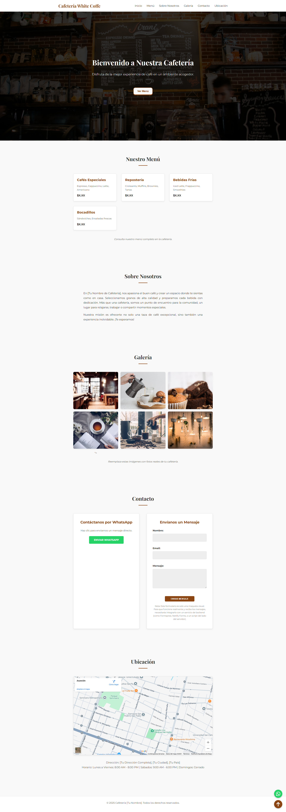

# Proyecto: Página Web de Café ☕

Este proyecto es una página web moderna y responsive para una cafetería, desarrollada con HTML, CSS y JavaScript. Incluye un diseño atractivo, secciones interactivas y efectos visuales para mejorar la experiencia del usuario.

Características principales:

✅ Diseño elegante y responsive (adaptable a móviles, tablets y desktop).

✅ Menú interactivo.

✅ Efectos visuales (hover, animaciones CSS, sliders con JavaScript).

✅ Formulario de contacto con validación en tiempo real.

Tecnologías utilizadas:

HTML5 (Estructura semántica y accesible).

CSS3 (Flexbox, Grid, Transiciones y Keyframes).

JavaScript.

## Screenshots

